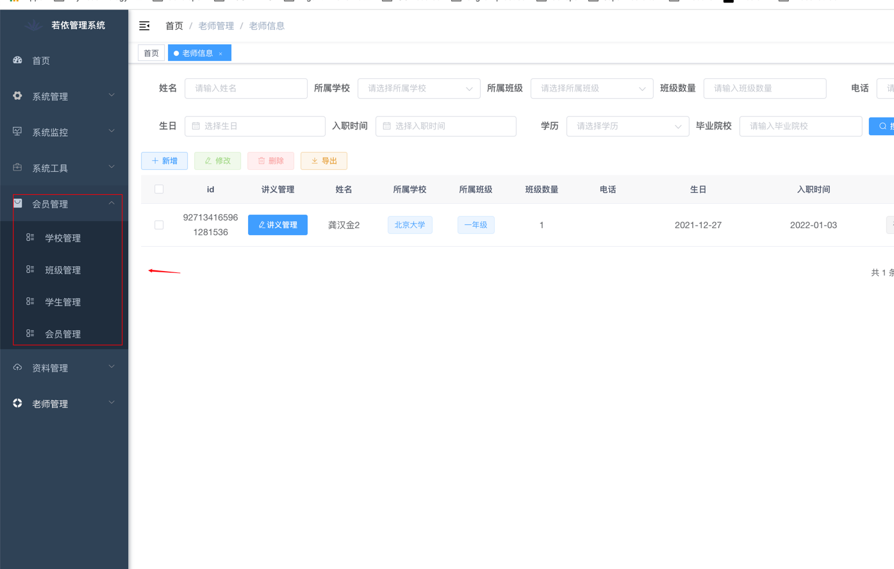
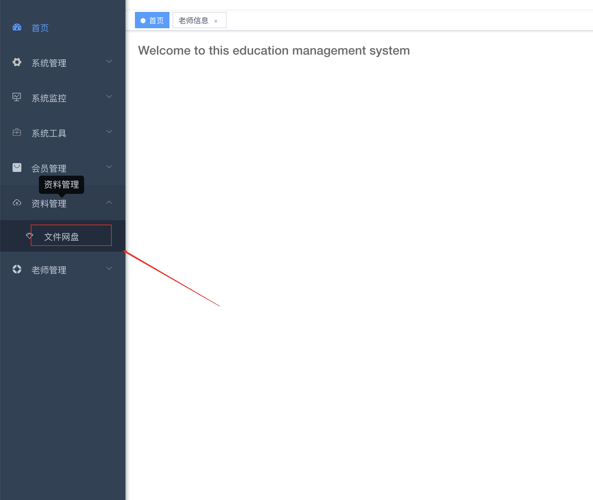
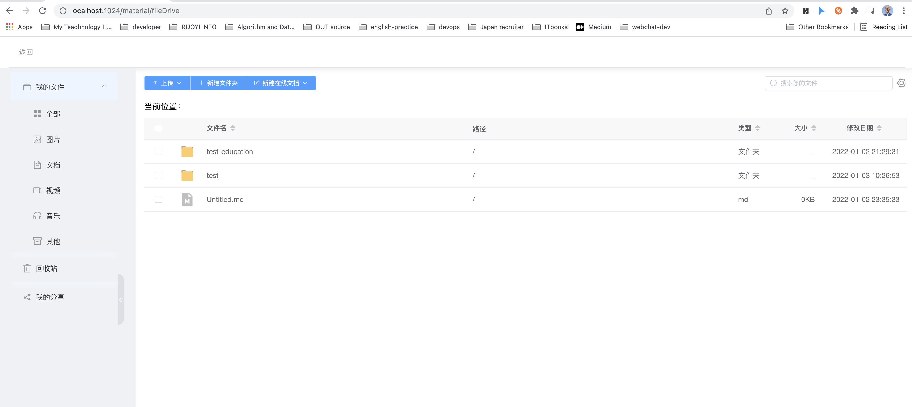
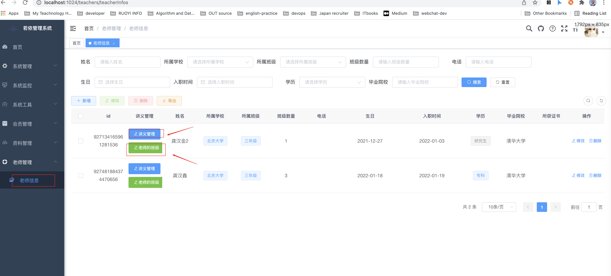
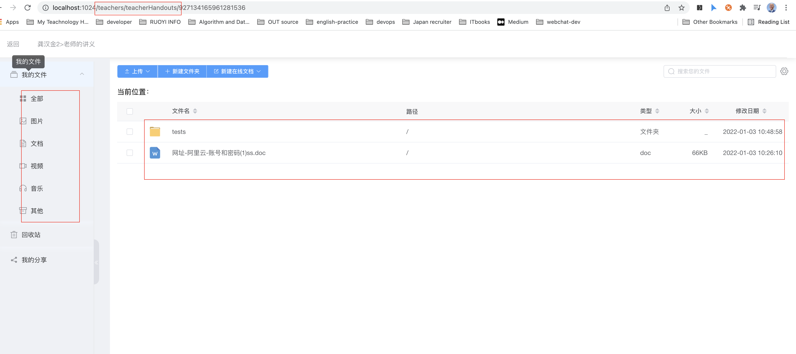

# 平台简介 
这是一个基于[若依RuoYi-Vue版本](https://gitee.com/y_project/RuoYi-Vue)实现的教育平台.

能批量改作业,管理学校,学生,文件网盘,讲义管理

* 前端采用Vue、Element UI。
* 后端采用Spring Boot、Spring Security、Redis & Jwt。
* 权限认证使用Jwt，支持多终端认证系统。
* 支持加载动态权限菜单，多方式轻松权限控制。
* 高效率开发，使用代码生成器可以一键生成前后端代码。
  RuoYi-Vue-extend为[RouYi-Vue](https://gitee.com/y_project/RuoYi-Vue)的扩展版

参考后台模板[vue-element-admin](https://github.com/PanJiaChen/vue-element-admin)

# 扩展版新增的功能


###  新增google authenticator验证并配置开关

[实现过程文档](https://richardgong1987.github.io/developer-qa/docs/app-info/ruoyi#3%E5%9C%A8ruoyi-vue%E5%8A%A0%E8%B0%B7%E6%AD%8C%E9%AA%8C%E8%AF%81%E7%A0%81):
```shell
https://richardgong1987.github.io/developer-qa/docs/app-info/ruoyi#3%E5%9C%A8ruoyi-vue%E5%8A%A0%E8%B0%B7%E6%AD%8C%E9%AA%8C%E8%AF%81%E7%A0%81
```
  
### 增加视图插入代码功能
```shell
https://github1s.com/richardgong1987/RuoYi-Vue-extend/commit/f58ce262fdd877dfc2d9b3cc7cd1d8a281a37e88
```

###   升级jdk8到jdk17,和,lombok
```shell
https://github1s.com/richardgong1987/RuoYi-Vue-extend/commit/5bfa77a4e1244e174d277113cc9b745c04ec2216
```

###  自定义密码匹配器 
```shell
https://github1s.com/richardgong1987/RuoYi-Vue-extend/commit/52efc8411499a453bcff90fb9eaa87de3b2ac06a
```
###  文件系统(基于minio,es) 
```shell
https://github1s.com/richardgong1987/RuoYi-Vue-extend/commit/2ce8aaa1a082973c6d9d9f4ddd31ae430c4c4524
```
###  学校管理
```shell
https://github1s.com/richardgong1987/RuoYi-Vue-extend/commit/ed80260bb1dbc370bbf1d591f360f676576a2dd2
```

项目还在不断更新迭代中. 有还有功能没完善. 大概会在2022年1月底会上一版,包含微信小程序.

# 安装方式

首先项目使用的是JDK17, 而不是jdk1.8注意哦.

如果用idea开发的,记得升级到2021.3以上. 因为2021.3对jdk17支持比较好.

### 第一步:

把基础后端和前端项目部署起来先.

因为本项目是基于RuoYi-Cloud的,只要把RuoYi-Cloud部署起来就成功了90%了,并且,决大部分文档只需要参考RuoYi-Cloud的就可以

[环境部署文档 | RuoYi-clould](http://doc.ruoyi.vip/ruoyi-cloud/document/hjbs.html)

```shell
http://doc.ruoyi.vip/ruoyi-cloud/document/hjbs.html
```

注意:

这里的mysql,redis密码统分别放在nacos各个不同的微服务配置文件中.要分开修改.

## 第二步:

把前面一步完成了后.

接下来作以下操作:

- 安装elasticsearch

https://www.elastic.co/elasticsearch/

- 安装minio

  https://min.io/

因为RuoYiFileApplication服务的网盘功能的搜索是基于elasticsearch的,文件管理默认使用的是minio


在项目根目录下的sql-eduction目录下有三个sql脚本

```shell
sql-eduction
|-- ry_config20220106.sql
|-- ry_clould20220105.sql

```

- ry-config20220106.sql请刷覆盖到ry-config库中
- ry-clould-2022-01-05.sql请刷覆盖到ry_vue_extend库中

  注意:

  这里的mysql,redis密码统一放在ruoyi-application-dev.yml

  另外minio的用户名和密码在ruoyi-file-dev.yml里需要修改

- 教育平台的微服务是RuoYiEducationAdminApplication,RuoYiFileApplication启动这个两个


作完前面两大步骤.就可以正常运行本项目了.

# 功能展示截图:

* ### 学校管理,班级管理,学生管理,会员管理 

* ### 文件网盘(用于管理素材,视频,绘本,一切文件管理)

  

  

* ### 讲义管理,各个老师班级管理

  

  


# 内置功能

1.  用户管理：用户是系统操作者，该功能主要完成系统用户配置。
2.  部门管理：配置系统组织机构（公司、部门、小组），树结构展现支持数据权限。
3.  岗位管理：配置系统用户所属担任职务。
4.  菜单管理：配置系统菜单，操作权限，按钮权限标识等。
5.  角色管理：角色菜单权限分配、设置角色按机构进行数据范围权限划分。
6.  字典管理：对系统中经常使用的一些较为固定的数据进行维护。
7.  参数管理：对系统动态配置常用参数。
8.  通知公告：系统通知公告信息发布维护。
9.  操作日志：系统正常操作日志记录和查询；系统异常信息日志记录和查询。
10. 登录日志：系统登录日志记录查询包含登录异常。
11. 在线用户：当前系统中活跃用户状态监控。
12. 定时任务：在线（添加、修改、删除)任务调度包含执行结果日志。
13. 代码生成：前后端代码的生成（java、html、xml、sql）支持CRUD下载 。
14. 系统接口：根据业务代码自动生成相关的api接口文档。
15. 服务监控：监视当前系统CPU、内存、磁盘、堆栈等相关信息。
16. 缓存监控：对系统的缓存信息查询，命令统计等。
17. 在线构建器：拖动表单元素生成相应的HTML代码。
18. 连接池监视：监视当前系统数据库连接池状态，可进行分析SQL找出系统性能瓶颈。


## 演示图

<table>
    <tr>
        <td></td>
        <td></td>
    </tr>
    <tr>
        <td></td>
        <td></td>
    </tr>
    <tr>
        <td></td>
        <td></td>
    </tr>
	<tr>
        <td></td>
        <td></td>
    </tr>	 
    <tr>
        <td></td>
        <td></td>
    </tr>
	<tr>
        <td></td>
        <td></td>
    </tr>
	<tr>
        <td></td>
        <td></td>
    </tr>
    <tr>
        <td></td>
        <td></td>
    </tr>
</table>


## 若依前后端分离交流群
## 联系本人

QQ:909253305

微信 :
live1520


